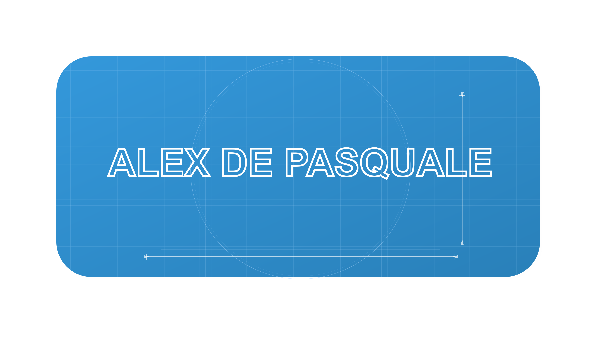

  

  <ul align="center" style="list-style: none">
    

      <h1>
        👋 Hi, my name is Alex
      </h1>
    

  </ul>

**<h3 align="left">Connect with me:</h3>** 

  

 **<h4 align="left">🚀 Passionate developer with expertise in Flutter, Java, and Python, crafting seamless cross-platform applications. Skilled in both front-end and back-end development, with foundational knowledge in JavaScript and Swift. Focused on delivering high-performance, user-centered solutions that scale.</h3>**

** **
 **<h3 align="left">Skills</h4>**

      

